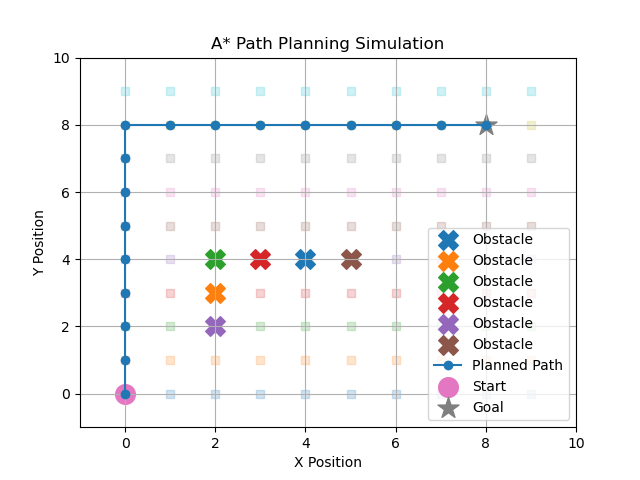

# ARC Core Simulation

ARC Core Simulation is the base simulation environment for a modular autonomous robotics stack.  
The goal of this project is to build a simple robotics simulation framework that can later connect with modules for control systems, robotic arm kinematics, navigation, computer vision, sensor diagnostics, and edge AI deployment.

## Project Goals

- Build a simple 2D robotics simulation environment
- Simulate robot movement in a grid or continuous space
- Add basic obstacles and navigation constraints
- Create a foundation for future robotics modules
- Connect simulation outputs to later perception, control, and planning systems

## Why This Project Matters

Modern robotics systems are not built from one model or one script. They require multiple connected layers:

- simulation
- sensors
- control systems
- perception
- path planning
- diagnostics
- deployment

This repository acts as the core environment where those modules can eventually be tested together.

## Planned Modules

This project is part of a larger robotics stack:

- `arc-core-simulation`
- `arc-robot-arm-kinematics`
- `arc-control-systems`
- `arc-sensor-diagnostics`
- `arc-vision-perception`
- `arc-navigation-planning`
- `arc-edge-ai-optimization`
- `arc-integrated-demo`

## Current Status

Initial repository created.  
Next step: build the first 2D robot movement simulation using Python.

## Tech Stack

- Python
- NumPy
- Matplotlib
- Object-oriented programming
- Basic robotics simulation concepts

## Future Work

- Add robot movement logic
- Add obstacles
- Add path planning
- Add sensor simulation
- Add visualization
- Connect with control and navigation modules

## How to Run

Install dependencies:

    pip install -r requirements.txt

Run the basic robot movement simulator:

    python3 src/robot_simulator.py

Run the grid world example:

    PYTHONPATH=. python3 examples/run_grid_world.py

Run the A* path planning simulation:

    PYTHONPATH=. python3 examples/run_path_planning.py
    
Run the sensor simulation:

    PYTHONPATH=. python3 examples/run_sensors_simulation.py

## Demo Output

### A* Path Planning Simulation

The A* planner calculates a path from a start position to a goal position while avoiding obstacles in a grid world.

## Current Features

- Basic robot movement simulation
- Grid world environment
- Obstacle placement
- Blocked movement detection
- A* path planning from start to goal
- Visualization using Matplotlib
- Simulated distance sensor readings
- Obstacle distance scanning in four directions
- Visualization using Matplotlib
